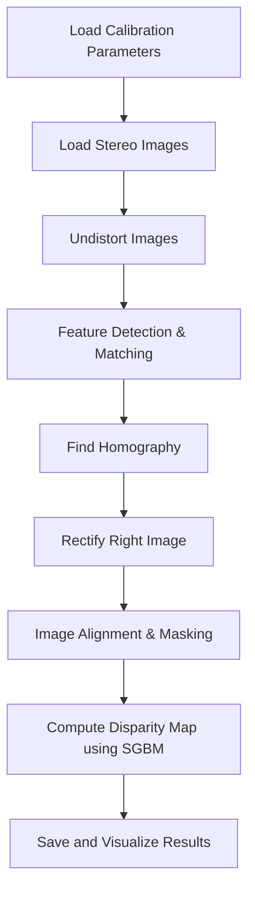
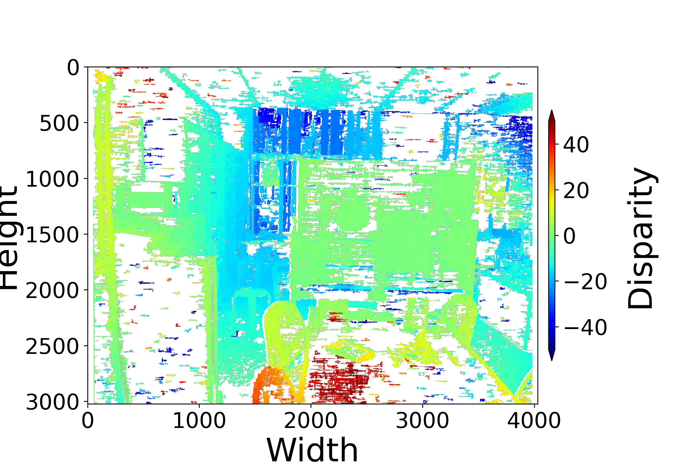

# note-opencv-disparity-stereo-camera

Thank You For Ref and Data. : https://qiita.com/koba_tomtom/items/8c7ff3ebcc77b29b465c

## Stereo Disparity Map Generation Pipeline

This README describes the process for computing a disparity map from a pair of stereo images using OpenCV. The pipeline involves camera calibration, image undistortion, keypoint matching, image rectification, and disparity map calculation using StereoSGBM.

## Directory Structure

```
project/
├── 20231211_disparity_calc/        # Contains stereo images (e.g., 13.png, 14.png)
├── 20231211_calibration_image/     # Contains camera calibration file (camera_parameter.npz)
├── disparity_script.py             # Main processing script
└── output/                         # Resulting images (e.g., keypoints, matches, disparity)
```

---

## Pipeline Overview



---

## Step-by-Step Summary

### 1. **Load Camera Calibration Parameters**

From `camera_parameter.npz`, the following parameters are loaded:

* `mtx`: Camera intrinsic matrix
* `dist`: Distortion coefficients
* `rvecs` and `tvecs`: Rotation and translation vectors (not used directly)

### 2. **Load Stereo Images**

Stereo pair images (e.g., `13.png` and `14.png`) are read in grayscale mode.

### 3. **Undistortion**

Using OpenCV's `cv.getOptimalNewCameraMatrix` and `cv.undistort`, images are corrected for lens distortion.

### 4. **Feature Detection and Matching**

* Uses `SIFT` for keypoint detection and description.
* Matches keypoints using `BFMatcher` with `cv.NORM_L1`.
* Only top 5% matches are kept.

### 5. **Homography Estimation and Rectification**

* Estimate homography matrix `H` using `cv.findHomography` and RANSAC.
* Apply perspective warp to the right image to align it with the left.

### 6. **Overlap Area Extraction**

* Mask both images to retain only overlapping regions.
* Extract valid regions for both left and rectified right images.

### 7. **Disparity Calculation**

* Uses `cv.StereoSGBM_create` with customized parameters.
* Outputs a floating point disparity image with invalid regions set to NaN.

### 8. **Visualization and Saving**

* Saves intermediate images: undistorted images, keypoints, matches, rectified right image, and the final disparity map.

---

## Output Files

| File                                         | Description                          | Preview                              |
| --------------------------------------------| ------------------------------------ | ------------------------------------ |
| `00-13-undistortion.png`                    | Undistorted left image               |         |
| `01-13-LeftImagewith-Key-Points.png`        | Keypoints on left image              |  |
| `02-Two-Images-with-Matched-Points.png`     | Top 5% matched points                |  |
| `03-Rectified-Right-Image.png`              | Right image warped with homography   |   |
| `04-Two-Images-with-Used-Matched-Points.png`| Matches used in RANSAC               |  |
| `05-Overlapped-Two-Images.png`              | Blended overlap of left/right images |   |
| `06-Disparity.png`                          | Final disparity map                  |               |

---

## Dependencies

```bash
pip install numpy opencv-python matplotlib
```

## 🐳 Run with Docker

You can use a pre-built Docker image with OpenCV:

```bash
docker run -it -v $PWD/workspace:/workspace hdgigante/python-opencv:4.11.0-ubuntu /bin/bash
```

## Notes

* Ensure `camera_parameter.npz` exists in the calibration folder.
* All steps save visual outputs for verification.
* The disparity image may need post-processing (e.g., filtering) for improved accuracy.

---

## Author

Generated and organized using OpenAI ChatGPT for documentation purposes.

---
